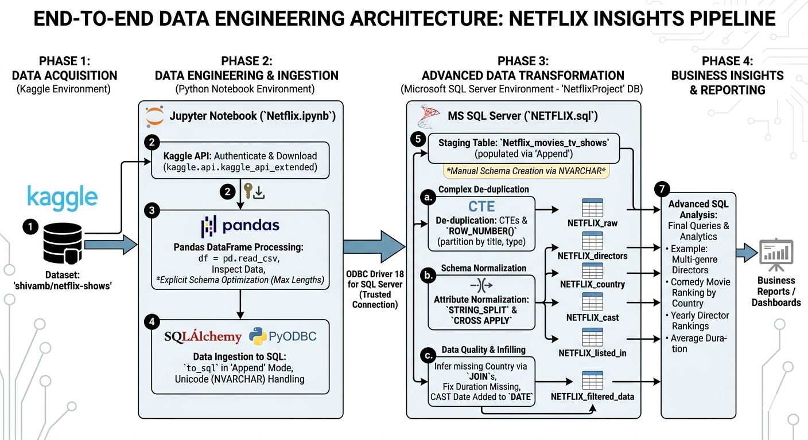

# Netflix Data Engineering & Analysis Project 🎬

## Overview
This project demonstrates an end-to-end data pipeline. It starts by fetching the Netflix dataset directly from Kaggle, processing it using Python, and then loading it into a structured MS SQL Server database for deep analysis.

## Project Workflow
1.  **Data Extraction:** Automated dataset download using the **Kaggle API**.
2.  **Data Ingestion & Cleaning:**
    *   Used **Pandas** for initial data inspection.
    *   Calculated maximum lengths of strings to optimize SQL data types.
    *   Handled Unicode characters (Korean, Chinese, etc.) using `NVARCHAR` through **SQLAlchemy**.
3.  **Database Optimization:**
    *   Converted `VARCHAR(MAX)` columns to optimized lengths to improve performance.
    *   Implemented data appending strategy to maintain schema integrity.
4.  **SQL Transformation & Analysis:**
    *   Handled duplicates using **CTEs** and `ROW_NUMBER()`.
    *   Normalized the data by splitting multi-valued attributes (Directors, Cast, Country, Listed_in) using `CROSS APPLY` and `STRING_SPLIT`.
    *   Cleaned missing values in the `Country` column by mapping directors to their common countries.

## Tech Stack
*   **Language:** Python
*   **Libraries:** Pandas, SQLAlchemy, PyODBC, Kaggle API
*   **Database:** MS SQL Server (SSMS)
*   **Tools:** Jupyter Notebook

## Key Analysis performed
The SQL analysis covers:
- Identifying directors who have created both Movies and TV Shows.
- Ranking countries based on specific genres (e.g., Comedies).
- Yearly ranking of directors with the maximum number of movie releases.
- Average duration of movies across different genres.

## How to Run
1.  Install dependencies: `pip install kaggle pandas sqlalchemy pyodbc`
2.  Configure your `kaggle.json` for API access.
3.  Run the `Netflix.ipynb` notebook to extract and load data into SQL Server.
4.  Execute the provided SQL scripts in **SQL Server Management Studio (SSMS)** for transformation and insights.

---

**Note:** This project focuses on data quality and performance optimization, ensuring that data types are precise and Unicode characters are preserved.
